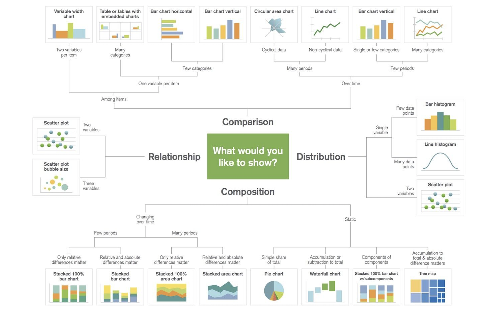

# データ可視化ライブラリのまとめ

Pythonによるデータの可視化ライブラリには様々なものがあります。用途に応じてそれらの可視化ライブラリを使い分けることが重要になってきます。ここでは、下記の可視化ライブラリの使用方法の一例を`notebooks`フォルダ中に保存しています。可視化の参考になれば幸いです。

## 作業環境

作成した段階での環境は以下の通り。バージョンが違っても多分大丈夫だと思いますが、もし上手くスクリプトが動かない場合は参考にしてください。

- Python: 3.11.9
- Pandas: 2.2.2
- NumPy: 1.26.4
- Maplotlib: 3.8.4
- japanize-matplotlib: 1.1.3
- seaborn: 0.13.2
- Plotly: 5.21.0
- Bokeh: 3.4.1
- squarify: 0.4.3
- nbformat: 5.10.4

## 可視化ライブラリ

- Matplotlib
  - 簡単なデータを手早く可視化したい人向け
- seaborn
  - 統計分析したい人向け
- Plotly
  - 3D形状をプロットしたい、データ点の数値を確認したい人向け
- Bokeh
  - かっこよくデータを人に見せたい、対話操作を入れたい人向け

## 可視化ライブラリの特徴

### Matplotlib

:thumbsup: 良い点

- 簡単なデータをプロットするのが楽。
- プロットの機能が充実している。
- 日本語の情報が他と比べると多い。
- `pandas`の`DataFrame.plot`メソッドなどから直接プロットできる。

:thumbsdown: 悪い点

- デフォルトで日本語対応できない
- 命令型のAPI(plt)とオブジェクト指向(ax)のAPIが混在していて、混乱することがある。
- 対話操作のレスポンスが良くない。
- 3Dプロットに適していない。

### Seaborn

:thumbsup: 良い点

- 統計分析に特化した超高水準のAPIがたくさんある。
- 少ないコード量で書くことが出来る
- Jitter（重複して見えにくい点をずらしてプロットする機能）が便利

:thumbsdown: 悪い点

- 細かい調整はMatplotlibのスタイルが必要となる。

### Plotly

:thumbsup: 良い点

- Notebook上で対話的にグラフを動かせる。
- 対話的に動かせるグラフをHTML化して人に渡せる。
- データ点の数値を表示する機能がデフォルトで有効になっている。
- 3Dプロットが容易でレスポンスもいい。

:thumbsdown: 悪い点

- グラフの設定が面倒。
- 情報が少なめ。
- 有料の機能がある。（基本は無料）

### Bokeh

:thumbsup: 良い点

- 大体Plotlyと同じ特徴。対話的にグラフを動かせる。
- ドキュメントが読みやすい

:thumbsdown: 悪い点

- 3Dプロットが出来ない。
- グラフの設定が面倒。

## 可視化手法の使い分け

[5 Quick and Easy Data Visualizations in Python with Code](https://towardsdatascience.com/5-quick-and-easy-data-visualizations-in-python-with-code-a2284bae952f)では可視化手法について以下のような使い分けを推奨している。

  

用途とよく利用されるものとして以下が挙げられる。

- 関係
  - 散布図
  - バブルチャート
- 比較
  - 棒グラフ
  - 積み重ね棒グラフ
  - 折れ線グラフ
  - 面グラフ
- 構成
  - ツリーマップ
  - 100%積み重ね棒グラフ
  - 円グラフ
- 分布
  - 箱ひげ図
  - ヒストグラム
  - バイオリンプロット

### 散布図

**2つのデータの相関関係を把握するときに活用される**グラフ。

### バブルチャート

散布図に**点の大小や色の変化により3つ以上のデータについても表現した**グラフ。3次元的な表現にたけている。

### 棒グラフ

数値を棒の長さで表したグラフであり、項目間の数値比較に利用されるグラフ。どれが他の項目より優れているか、同程度であるかが一目で把握できる。通常縦棒グラフであるが、比較項目の文字数が多かったり、比較項目が3項目以上の場合は横棒グラフが用いられる事も多い。

### 積み重ね棒グラフ

項目ごとの集計地と項目内の各要素の比率を把握するときに活用されるグラフ。縦軸に構成比、横軸に比較て対象といった図表の構成になる。

### 折れ線グラフ

時系列など**連続した数値の変化を表す**ときに活用されるグラフ。ただし、ラベルの種類数が10を超えたあたりから線が重なるなどで見づらくなる。推奨数は5で、それ以上の場合はグラフを複数に分けるほうが無難。

### 面グラフ

データの増減の推移だけでなく、全体的な特徴量ごとの比率や数量を表現するときに活用されるグラフ。折れ線グラフに基づき、X軸方向エリア（軸と折れ線で挟まれた領域）に色を付けたグラフ。

### ツリーマップ

項目内の割合を比較するのに活用されるグラフ。大きな長方形の中に小さな長方形を使用して階層データが表示される。

### 100%積み重ね棒グラフ

棒の長さを100%と見なし、各要素の構成比を可視化するときに活用されるグラフ。円グラフと異なる点は、複数の要素の構成比を1つのグラフで可視化できる。

### 円グラフ

各カテゴリが全体に対して占める割合が一目でわかるグラフ。比較項目が1つの場合に用いる。

### ヒストグラム

箱ひげ図同様データのばらつき具合をあらわすためのグラフ。箱ひげ図では中央値や四分位点がどこにあるかを示すだけだったが、ヒストグラムではどの数値帯にデータが何件（または全体データ数の何%）が出現したかを表現するため、データのばらつきが克明にわかる。基本的に1系列の数値データのみしか扱えないので複数のラベルについて調べたいという場合はラベル毎に別々にグラフを作成する必要があるが、数値データの性質を調べるためには強力な可視化手法。

### 箱ひげ図

データのばらつき具合を表すためのグラフ。これによってラベル毎に数値のばらつきがどの程度あるか？ということを概ね理解することができる。この箱の部分が狭いほどその範囲に数値が集中していることを意味し、箱が広いほど数値がばらついていると読み取ることができる。

### バイオリンプロット

データの分布を表すためのグラフ。密度プロットを90°開店したものを複数の変数に対して描画する。箱ひげ図ほど分布形状の情報を落とさずに、複数の分布を容易に比較できる。

## 利用しているデータについて

### diabetes.csv

[Scikit-lean](https://www4.stat.ncsu.edu/~boos/var.select/diabetes.html)から取得した糖尿病患者における1年後の糖尿病の進行度の予測を目的としたデータセット。

| 特徴量 |                          説明                           |
| :----: | :------------------------------------------------------ |
|  age   | 患者の年齢                                              |
|  sex   | 患者の性別                                              |
|  bmi   | BMI（肥満度）                                           |
|   bp   | 平均血圧                                                |
|   s1   | TC（血液中の総コレステロール値）                        |
|   s2   | LDL（低比重リポタンパク質、悪玉コレステロール）         |
|   s3   | HDL（高比重リポタンパク質、善玉コレステロール）         |
|   s4   | TCH（＝TC÷HDL＝総コレステロール値／善玉コレステロール） |
|   s5   | LTG（血液中の中性脂肪値の対数）                         |
|   s6   | GLU（血糖値）                                           |
|   y    | 一年後の糖尿病の進行度を数値化したもの（目的変数）      |

### city_temperature.csv

[GitHub](https://gist.github.com/mbostock/3884955)から取得したアメリカのNewYork、San Francisco、Austinの3地点の2011年における気温のデータセット

### diamond.csv

[kaggle](https://www.kaggle.com/datasets/shivam2503/diamonds)から取得した54000個のダイヤモンドの価格や特徴を記載されたデータセット。

| 特徴量  |                                    説明                                    |
| ------- | -------------------------------------------------------------------------- |
| price   | ダイヤモンドの価格                                                         |
| carat   | ダイヤモンドのカラット重量                                                 |
| cut     | カットの品質(Fair, Good, Very Good, Premium, Ideal)                        |
| color   | ダイヤモンドの色(J(worst)～D(best))                                        |
| clarity | ダイヤモンドの透明度(I1(worst), SI2, SI1, VS2, VS1, VVS2, VVS1, IF (best)) |
| x       | 長さ(mm)                                                                   |
| y       | 幅(mm)                                                                     |
| z       | 深さ(mm)                                                                   |
| depth   | 総深さ百分率 = z / mean(x, y) = 2 * z / (x + y)                            |

### iris.csv

機械学習ライブラリ**scikit-learn**から取得したアヤメの特徴と種類を記載した有名なデータセット。

|    特徴量    |    説明    |
| :----------: | :--------: |
| sepal length | がくの長さ |
| sepal width  |  がくの幅  |
| petal length | 花弁の長さ |
| petal width  |  花弁の幅  |

### japan_energy.csv

[経済産業省 資源エネルギー庁](https://www.enecho.meti.go.jp/about/whitepaper/2014html/2-1-1.html)から取得した1973年から2013年における日本の一次エネルギー国内供給の推移。石油・石炭・天然ガス・原子力・水力・地熱などの新エネルギーの供給量が記載されている。

### japan_population.csv

[総務省統計局](https://www.stat.go.jp/data/nihon/02.html)から取得した令和4年における都道府県の世帯人数データ。
